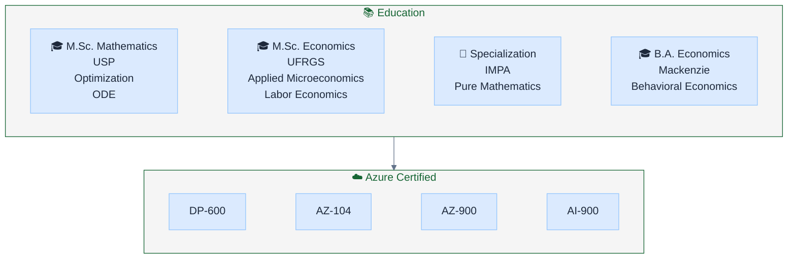

# Hey, I'm Ricardo Cataldi 👋

```python
from abc import ABC, abstractmethod

class Builder(ABC):
    """I'm a Builder — this is how I construct myself."""

    @abstractmethod
    def add_education(self): pass
    @abstractmethod
    def add_expertise(self): pass
    @abstractmethod
    def add_achievements(self): pass
    @abstractmethod
    def add_projects(self): pass

class RicardoBuilder(Builder):
    def __init__(self):
        self._ricardo = {
            "role": "Senior Solution Engineer @ Microsoft (GBB - AI, Apps & Agents)",
            "location": "São Paulo, Brazil",
            "citations": "106+",
            "revenue_influenced": "US$180M+",
        }

    def add_education(self):
        self._ricardo["education"] = [
            "M.Sc. Mathematics — USP (Monte Carlo, Brownian Motion)",
            "M.Sc. Applied Economics — UFRGS (Spatial Economics)",
            "Specialization — IMPA (Pure Mathematics)",
            "B.A. Economics — Mackenzie",
        ]
        return self

    def add_expertise(self):
        self._ricardo["expertise"] = {
            "languages": ["Python", "TypeScript", "Go", "SQL"],
            "ai_ml": ["Semantic Kernel", "PyTorch", "Recommendation Systems", "Context Engineering"],
            "cloud": ["Azure (DP-600, AZ-104)", "Kubernetes", "Bicep", "Terraform"],
            "domains": ["AI Agents", "MLOps", "Event-Driven Architecture", "AI Governance"],
        }
        return self

    def add_achievements(self):
        self._ricardo["achievements"] = [
            "Academic Coordinator — ML Engineering @ FIAP",
            "Creator of A.M.A.N.D.A (AI Agents Management & Operations)",
            "Arctic Code Vault Contributor",
            "Pull Shark x3 | Pair Extraordinaire x2",
        ]
        return self

    def add_projects(self):
        self._ricardo["projects"] = {
            "Holiday Peak Hub": "21 AI agents for retail commerce",
            "Tutor": "Intelligent tutoring with AI avatars",
            "Tayra": "Call center analytics GenAI platform",
            "k8savancado": "Kubernetes Advanced course @ FIAP",
        }
        return self

    def build(self):
        return self._ricardo

# Construct Ricardo
ricardo = (
    RicardoBuilder()
    .add_education()
    .add_expertise()
    .add_achievements()
    .add_projects()
    .build()
)
```

## 🚀 What I Do

- **Build** AI-powered enterprise solutions at Microsoft (US$180M+ revenue influenced)
- **Teach** Machine Learning Engineering & Kubernetes Advanced at FIAP
- **Research** context engineering and AI governance (106+ academic citations)
- **Create** A.M.A.N.D.A — AI Agents Management and Operations framework
- **Write** about AI, microservices, and human-AI collaboration on [Medium](https://medium.com/@cataldi.ricardo)

## 🎓 Education & Certifications



## 🔬 Current Focus

| Project | Description | Tech |
|---------|-------------|------|
| **Agentic Microservices** | Book on AI agent architecture patterns | Research, Writing |
| **Context Engineering** | Research paper on optimal AI context | LaTeX, Theory |
| **A.M.A.N.D.A** | AI Agents Management & Operations framework | Python, Governance |
| **k8savancado** | Kubernetes Advanced course (9 modules) | Rust, Helm, KEDA |

## 🛠️ Tech Stack

**Languages:** Python • TypeScript • Go • SQL

**AI/ML:** Semantic Kernel • PyTorch • TensorFlow • FastAPI • Recommendation Systems

**Cloud:** Azure (Expert) • Kubernetes • Bicep • Terraform • Event-Driven Architecture

**Data:** Cosmos DB • Redis • PostgreSQL • Polars • PySpark

**Domains:** AI Agents • MLOps • Context Engineering • AI Governance • DDD

## 📝 Latest Writing

- [Designing Context for AI](https://medium.com/@cataldi.ricardo) — Technical Guide in Low-Resource Languages
- [Context Topology and Optimal Balance](https://medium.com/@cataldi.ricardo) — AI context management
- [A.M.A.N.D.A Series](https://medium.com/@cataldi.ricardo) — AI Agents Management & Operations (4 articles)
- [Breaking Barriers: AI for Originary Peoples](https://medium.com/@cataldi.ricardo) — AI accessibility research
- [Beyond the Next Token](https://medium.com/@cataldi.ricardo) — Why AI thrives with us, not instead of us
- [Compliance and Governance App with PyRIT](https://medium.com/@cataldi.ricardo) — AI security testing
- [Designing Data-Driven Microservices](https://medium.com/@cataldi.ricardo) — The good, the bad, and the data-driven

## 🚀 Featured Projects (Azure Samples)

| Project | Description | Stars |
|---------|-------------|-------|
| [Holiday Peak Hub](https://github.com/Azure-Samples/holiday-peak-hub) | Agent-driven retail accelerator with 21 AI services, multi-tier memory (Redis/Cosmos/Blob), FastAPI + MCP | ⭐ |
| [Tutor](https://github.com/Azure-Samples/tutor) | Intelligent tutoring platform with AI avatar interactions, essay evaluation, professor dashboard | ⭐ 13 |
| [Tayra](https://github.com/Azure-Samples/tayra) | Call center analytics GenAI for transcription, sentiment analysis, compliance checking | ⭐ 11 |
| [k8savancado](https://github.com/Cataldir/k8savancado) | Kubernetes Advanced course: Health, Scheduler, Rollouts, Helm, Blue/Green, Canary, KEDA | |

## 📚 Publications

| Title | Venue | Citations |
|-------|-------|-----------|
| An integration of traceability elements and their impact in consumer's trust | Food Control (2018) | 106+ |
| A model for forming long-term partnerships in the construction industry | Ambiente Construído (2018) | 8 |

## 🏆 Recognition

<p align="center">
  
</p>

**GitHub Achievements:** Arctic Code Vault Contributor • Pull Shark x3 • Pair Extraordinaire x2 • YOLO

## 🤝 Let's Connect

[](https://www.linkedin.com/in/cataldir)
[](https://medium.com/@cataldi.ricardo)
[](mailto:cataldi.ricardo@gmail.com)

---

<p align="center">
  <i>"AI should thrive alongside humans, not instead of them."</i>
</p>

<p align="center">
  
</p>
